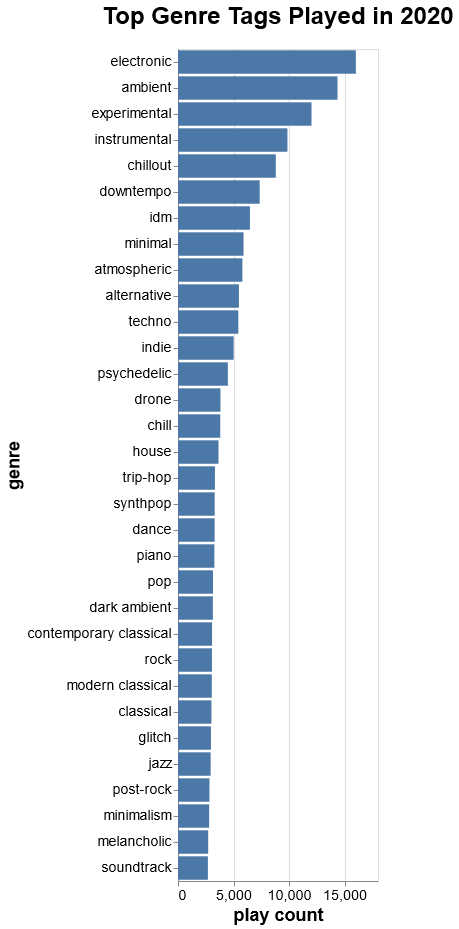

# Last.fm Stats

This is a tool I wrote to generate year-end charts and graphs for my listening 
data in Last.fm. The binary downloads artists listened to and tags associated 
with each to files. Then I use vega-lite to display charts based on the data.

Right now it just generates this, my top played genres of the year:



## .env file

Running the downloads requires you set two variables in the environment:

```
LASTFM_USER=thallada
LASTFM_API_KEY=<apikey-goes-here>
```

## Generating chart

I couldn't get `vg2png` to generate a chart that had bars for some reason, but 
if I copy the JSON from `tags.json` into `"data": { "values": [...] }` and then 
paste that into the [online editor](https://vega.github.io/editor/) it works.
